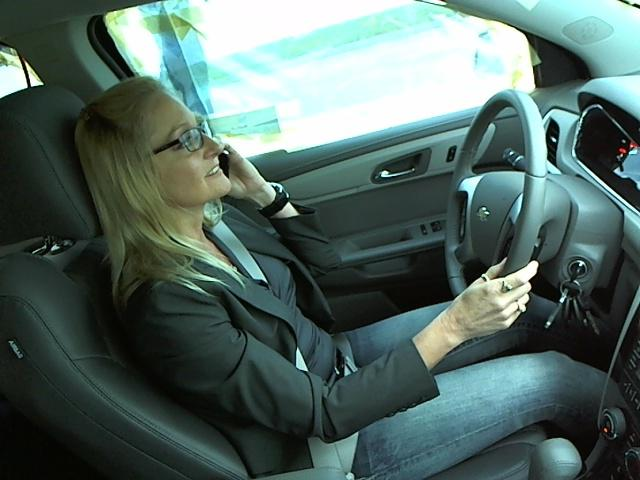

# Machine Learning Engineer Nanodegree
## Capstone Proposal
Punita Ojha  
March 17th, 2019

### Domain Background

We are working on a real world project titled **'State Farm Distracted Driver Detection'**.  The problem statement is a part of a kaggle competition where the problem statement is proposed by State Farm . We've all been there: a light turns green and the car in front of you doesn't budge. Or, a previously unremarkable vehicle suddenly slows and starts swerving from side-to-side.

When you pass the offending driver, what do you expect to see? You certainly aren't surprised when you spot a driver who is texting, seemingly enraptured by social media, or in a lively hand-held conversation on their phone.

According to the CDC motor vehicle safety division, one in five car accidents is caused by a distracted driver. Sadly, this translates to 425,000 people injured and 3,000 people killed by distracted driving every year.

State Farm hopes to improve these alarming statistics, and better insure their customers, by testing whether dashboard cameras can automatically detect drivers engaging in distracted behaviors. Given a dataset of 2D dashboard camera images, State Farm is challenging Kagglers to classify each driver's behavior. Are they driving attentively, wearing their seatbelt, or taking a selfie with their friends in the backseat? The link to the dataset of this problem is here https://www.kaggle.com/c/state-farm-distracted-driver-detection/data . We can download the dataset from this link . I have explained more details about the dataset of this problem in the ReadMe.md file submitted along with this . Also the section in the proposal named 'Dataset and Input' also explains the same . 

The domain background of this problem statement is computer vision. Computer Vision is the broad parent name for any computations involving visual content – that means images, videos, icons, and anything else with pixels involved. The various sub-fields of computer vision are - Object Classification, Object Identification, Motion Analysis, Image Classification, Scene Reconstruction, Image Restoration etc. Our project falls into the category of image classification. In image classification, we train a model on a dataset of some training images, and the model classifies new images as belonging to one or more of your training categories. The solution to these kind of problems can be found using deep learning and transfer learning. 

Also here is the link of research paper from stanford [https://web.stanford.edu/class/cs231a/prev_projects_2016/egpaper_final%20(3).pdf] where deep learning is applied to recognise human activities from videos. Thus this research paper cites the use of deep learning in a similar type of problem .  

The personal motivation for picking up problem from the domain of computer vision is before taking this course, I always heard about image recognization and classification, computer vision but how this is actually achieved was mere imagination for me. While undergoing lessons of deep learning in this course, the domain drived me crazy. The choice of project is also pretty close to my heart because if using computer vision we can reduce the number of accidents taking place by tracking or detecting distracted drivers, it will be wonderful contribution to humankind and the impact is we can reduce accidents which can save lot of innocent lives. 

### Problem Statement

The problem statement is shared on kaggle.com as a competition by one of the start ups named **'State Farm - a financial insurance corporation'** .

In this competition you are given driver images, each taken in a car with a driver doing something in the car (texting, eating, talking on the phone, makeup, reaching behind, etc). Our goal is to predict the likelihood of what the driver is doing in each picture. 

We need to classify each image into one of these 10 Classes . 

- c0: safe driving
- c1: texting - right
- c2: talking on the phone - right
- c3: texting - left
- c4: talking on the phone - left
- c5: operating the radio
- c6: drinking
- c7: reaching behind
- c8: hair and makeup
- c9: talking to passenger

### Datasets and Inputs

The dataset for the project can be downloaded from [here] https://www.kaggle.com/c/state-farm-distracted-driver-detection/data 

The dataset contains three files : - 

**1. imgs.zip** - The zip file 'imgs.zip' contain two folders namely **train** and **test** .

- **'train' Folder** contains 10 sub-folders inside it . Each of these folders contains training images belonging to a specific class as the name specified on the folder . The brief description of each of these sub - folders and also an image to explain how these are structured.  

  **a)** **'c0'** - contains 2489 training images of drivers driving safely.  
  
  **b)** **c1** - contains 2267 training images of drivers who are texting using their right hand. 
  
  **c)** **c2** - contains 2317 training images of drivers who are talking on phone using their right hand. 
  
  **d)** **c3** - contains 2346 training images of drivers who are texting using their left hand . 
  
  **e)** **c4** - contains 2326 training images of drivers who are talking on phone using their left hand. 
  
  **f)** **c5** - contains 2312 training images of drivers who are operating radios. 
  
  **g)** **c6** - contains 2325 training images of drivers who are drinking. 
  
  **h)** **c7** - contains 2002 training images of drivers who are reaching behind.
  
  **i)** **c8** - contains 1911 training images of drivers who are engaged in grooming their hairs or doing makeup . 
  
  **j)** **c9** - contains 2129 training images of drivers who are talking to a passenger close by . 
  
  There are total 22424 training images in our dataset with about 26 unique drivers.
  
  **Here is a sample image from each of these classes**.  
  
  
  
  
  
  
  
  
  
  
  
 
  **Lets plot a graph of number of training images versus Class Names it belongs to .**
  
  
  
  Thus we can see clearly from the plot that the classes are not balanced some classes have more training images that means more learning data than others . We can see clearly from the plot that Class c0 have highest training images that means it has largest learning data . And it will be very difficult to predict c8 because has least training images and hence least learning data. Also we can say that it will be difficult to train this model because there are only 26 unique drivers in the training set so it is quite possible that the model aims to identify the person in the image rather than the actions or activities the person is performing. 
  
- **test Folder** - The test folder contains 79726 test images of drivers in car . We are going to make our predictions on this test images . 

The size of images in both training set and test set are 640 * 480 pixels and all the images are colour images.   

Also another very important point to note about the dataset is the train and test data are split on the drivers, such that one driver can only appear on either train or test set. 

**2. sample_submission.csv** - a sample submission file in the correct format . 

**3.driver_imgs_list.csv** - a list of training images, their subject (driver) id, and class id

### Solution Statement

I will use deep learning algorithms to train these driver images to do multi-class classification of these images using libraries like keras. I would use a convolutional neural network to train the images because convolutional neural networks generally do a pretty good job with image classification . I would also use the concept of transfer learning because my experience with advanced machine learning  course by udacity and project like cancer detection and dog breed classification justifies that pre-trained models can also do wonderful job with classification of images. So we will try different pre-trained neural networks like VGG-16, VGG-19, ResNet-50, Inception, Xception etc. and will test our accuracy on these and choose the best one as our solution . Also we will try techniques like image augmentation to get better accuracy .Also hypertuning the parameters will also help us to get better accuracy . 

### Benchmark Model

Our benchmark model will help us compare how better our model is as follows . Since this is a problem statement picked up from kaggle.com , we will make our submissions on kaggle.com and compare our score against other competitors . Our goal would be to make it among top 40% of participants on kaggle.com as of now entry number 576(Top 40% of competitors) on kaggle submissions. The multi-class logarithmic loss for this 576th submission entry on kaggle.com is 1.16598. Our objective will be to perform better than this threshold value there by achieving a multi-class logarithmic loss value less than this using our transfer learning model. 

We will submit a .csv file with our predicted outputs against all test images on kaggle.com and check our score against other competitors.  

The evaluation criteria to get this score will be based on multi-class logarithmic loss function. 

Please note that I did not encounter any such historical model for this project so we are using threshold value from kaggle submission . 

### Evaluation Metrics

We will evaluate using the multi-class logarithmic loss function . Each image in our test set will be labeled with one true class. For each image, you must submit a set of predicted probabilities (one for every image). The formula is then,

**logloss=−1N∑i=1N∑j=1Myijlog(pij)**

where N is the number of images in the test set, M is the number of image class labels,  log is the natural logarithm, yij is 1 if observation i belongs to class j and 0 otherwise, and pij is the predicted probability that observation i belongs to class j.

The submitted probabilities for a given image are not required to sum to one because they are rescaled prior to being scored (each row is divided by the row sum). In order to avoid the extremes of the log function, predicted probabilities are replaced with max(min(p,1−10−15),10−15).

### Project Design

We will start with initially developing understanding about problem statements . From the problem statements understanding we have already drawn our conclusions that the problem statement is from the domain of computer vision and CNNs will be used to train such a model . We will then develop more understand about our dataset and preprocess our dataset . Then we will use this pre processed dataset with different pre-trained networks like VGG-16, VGG-19, Inception, Xception etc. and draw conclusions about the results . Also we will do image augmentation and hypertuning of parameters to get better accuracy . Then we will submit our predicted results against test set on kaggle and check our score . If none of these conclusions work out for us we may design our own convolutional neural network from scratch. 

### References

1. Problem Statement : **State Farm Distracted Driver Detection** 
https://www.kaggle.com/c/state-farm-distracted-driver-detection

2. Brief description about computer vision and its sub-fields .  
https://blog.algorithmia.com/introduction-to-computer-vision/

3. Better understanding of tranfer learning  
http://cs231n.github.io/transfer-learning/

4. Convolutional Neural Networks.  
https://www.youtube.com/watch?v=bNb2fEVKeEo

 

